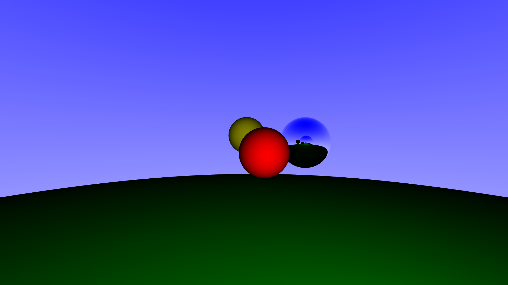

# Simple Raytracer (Work in Progress)

I would like to say that I've been writing raytracers before it was cool, but that would be a lie. I was drawn to it because it's a highly visual endeavour, and allows me to apply some concepts from linear algebra and geometry while gaining more familiarity with Rust. In its current state, the program can renders specular and diffuse spheres using recursive raytracing and subpixel antialiasing.

## Obligatory Rendered Image

## Sources
[Physically Based Rendering](https://www.pbrt.org/) inspired me to attempt this, [Ray Tracing in One Weekend](https://github.com/petershirley/raytracinginoneweekend) let me hit the ground running and [Mathematics for 3D Game Programming
and Computer Graphics](http://mathfor3dgameprogramming.com/) is an excellent reference.

## Todo
This is a labour of love, so the following is a list of interesting things for me to do:
- [ ] Refraction
- [ ] Polygons
- [ ] Textual format for scene description